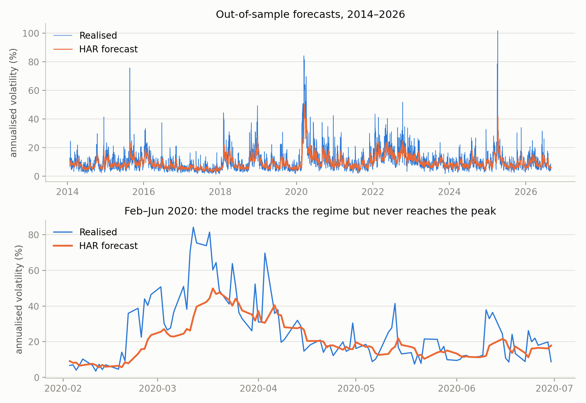
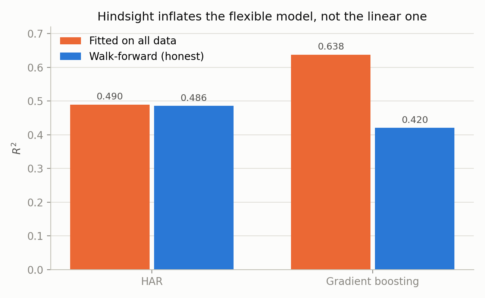
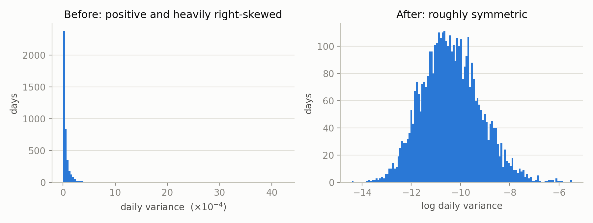

# Realised Volatility Forecasting (S&P 500)

Forecasting one-day-ahead realised volatility for SPY from 16 years of daily data, comparing a
linear HAR benchmark against ridge and gradient boosting under strict walk-forward validation.

---

## Motivation

<!-- Q1 — your paragraph, already written. Keep or refine. -->

Returns are unpredictable because predictability destroys itself — a forecast that the price
will rise makes people buy now, which moves the price now. That argument bites on direction
only: knowing tomorrow will be turbulent doesn't tell you which way, so there is nothing to
arbitrage away. Magnitude is different, and volatility is a measure of magnitude — the lag-1
autocorrelation of log variance is 0.626, against roughly zero for returns themselves.

The largest single-day gain and the largest single-day loss in the sample fall within days of
each other in March 2020. Direction was not forecastable on any of those days; magnitude clearly
was.

---

## Results

Out-of-sample, 3,170 trading days (2014–2026). Every model uses the identical walk-forward
procedure: expanding training window, refit monthly, never trained on data after the day it
predicts.

| Model | RMSE (log variance) | Out-of-sample R² | Typical error factor |
|---|---|---|---|
| Random walk | 1.029 | 0.290 | 2.80× |
| **HAR** | **0.875** | **0.486** | **2.40×** |
| Ridge | 0.875 | 0.486 | 2.40× |
| Gradient boosting | 0.929 | 0.420 | 2.53× |

HAR reduces forecast RMSE by **14.9%** against a random-walk benchmark and outperforms it in
**13 of 13 calendar years**.

**Gradient boosting lost.** R² of 0.420 against HAR's 0.486, and it lost in 12 of 13 years.
Ridge was indistinguishable from ordinary least squares to four decimal places. Both outcomes
were predicted before running them, and both are explained below.

<!-- Q10 — rewrite in your own words once you've answered it. -->

The typical error factor is `exp(RMSE)`: the characteristic miss is a factor of about 2.4 in
variance, roughly **55% in volatility terms**. An R² of 0.49 and "typically wrong by half" are
the same fact stated two ways, and both belong in an honest summary.

### Year by year



*Both series are indexed by forecast date; the apparent lag is the model reverting toward the
mean, not a misalignment.*

| Year | n | Random walk | HAR | GBM |
|---|---|---|---|---|
| 2014 | 237 | 0.073 | 0.267 | 0.114 |
| 2015 | 252 | −0.004 | 0.251 | 0.098 |
| 2016 | 252 | 0.110 | 0.374 | 0.263 |
| 2017 | 251 | −0.489 | 0.018 | −0.239 |
| 2018 | 251 | 0.351 | 0.501 | 0.462 |
| 2019 | 252 | −0.015 | 0.296 | 0.228 |
| 2020 | 253 | 0.444 | 0.536 | 0.462 |
| 2021 | 252 | 0.116 | 0.302 | 0.227 |
| 2022 | 251 | −0.422 | 0.075 | 0.004 |
| 2023 | 250 | −0.191 | 0.239 | 0.178 |
| 2024 | 252 | −0.236 | 0.159 | 0.097 |
| 2025 | 250 | 0.326 | 0.474 | 0.482 |
| 2026 | 167 | −0.235 | 0.195 | 0.109 |

2014 and 2026 are partial: the test window opens partway through 2014, and 2026 runs to the data
cut-off. The "13 of 13" claim therefore covers eleven complete years and two partial ones.

<!-- Q8 — rewrite in your own words once you've answered it. -->

**Pooled R² overstates within-year skill.** Pooled HAR R² is 0.486; the median annual figure is
**0.267**. Much of the pooled number comes from tracking the *level* of volatility across
regimes — knowing 2020 is turbulent and 2017 is calm, which the 22-day feature supplies almost
for free. Day-to-day variation within a regime is the harder problem, and is worth roughly 0.27.

**The random walk is negative in 7 of 13 years.** Within a calm year the volatility level barely
moves and day-to-day changes are largely measurement error; "tomorrow equals today" chases that
error, while the year's mean ignores it. It only looks respectable pooled because pooling
reintroduces the differences in level between years.

### Why gradient boosting lost

<!-- Q6 — rewrite in your own words once you've answered it. -->

The relationship is close to linear in logs, so a model built from step functions can only
approximate it; three heavily correlated features leave no interactions to discover; and a large
share of the target is measurement error, which a flexible model will happily fit.

2017 is the clearest case. In the calmest year in modern equity history, HAR scored 0.018 —
correctly finding almost nothing — while gradient boosting scored **−0.239**, worse than
forecasting the mean. With no signal present, extra flexibility does not sit idle; it fits noise
and produces forecasts worse than useless.

Gradient boosting's deficit is largest in 2017, 2014 and 2015. Two explanations are consistent
with this and cannot be distinguished from 13 annual observations: low signal in calm periods,
and small training sets in the earliest test years for a model that needs more data than HAR.

### Both models fail in the tail

| | Annualised volatility |
|---|---|
| Largest realised value | **101.8%** |
| Largest HAR forecast ever made | 49.9% |
| Largest GBM forecast ever made | 53.4% |

<!-- Q9 — rewrite in your own words once you've answered it. -->

Across 3,170 days, neither model ever forecast anything close to a crisis. Both reasons are
structural. Both models forecast an expectation — an average outcome given recent conditions —
and averages do not reach record values. And the target is measured with error: the largest
observed values are large partly because they drew a large positive error, which cannot be
forecast by definition. The practical implication is that a volatility model of this kind
under-forecasts exactly when it matters most.

---

## The cost of getting validation wrong

Every result above comes from *walk-forward* evaluation: each day is predicted by a model trained
only on days before it, refitted monthly. To show what that discipline is worth, each model was
also run a second way — allowed to train on the entire sample, past and future, before predicting
each day.



| Model | Fitted on all data | Walk-forward | Hindsight premium |
|---|---|---|---|
| HAR | 0.490 | 0.486 | **0.004** |
| Gradient boosting | 0.638 | 0.420 | **0.217** |

<!-- Q7 — rewrite in your own words once you've answered it. -->

The flexible model gains **57× more** from hindsight than the linear one. With four coefficients
and 4,170 rows, HAR cannot memorise the data; with hundreds of trees, gradient boosting can.

The consequence is the point of this section. A careless version of this project — fit both
models on all the data, report R² — would have concluded that gradient boosting improved on the
classical benchmark by 34%. The walk-forward result is that it is 13% worse. **The naive
analysis does not merely overstate the gain; it reverses the ranking**, and nothing in its output
looks wrong.

---

## Data and target construction

**Source.** SPY daily OHLC from Yahoo Finance via `yfinance`, 2010-01-01 onward, dividend- and
split-adjusted. <!-- TODO: date you pulled the data --> 4,192 daily bars.

**Integrity checks.** All 4,192 bars satisfy `High ≥ max(Open, Close)` and
`Low ≤ min(Open, Close)`; no violations, and no negative Garman–Klass estimates, which is what
that constraint implies.

### Choosing a volatility estimator

Realised volatility is not observable and has to be constructed from daily bars. Three estimators
were implemented and compared rather than one being assumed:

| Estimator | Annualised mean | Lag-1 autocorrelation of log variance |
|---|---|---|
| Close-to-close | 17.1% | 0.121 |
| **Parkinson (1980)** | 13.3% | **0.626** |
| Garman–Klass (1980) | 13.5% | 0.643 |

<!-- Q3 — rewrite in your own words once you've answered it. -->

The autocorrelation column is the selection criterion. True volatility changes slowly, so
consecutive days are strongly related. Measurement error does not carry over from one day to the
next, so a noisy estimator reports weaker persistence than the quantity it is measuring. An
estimator scoring 0.121 is not telling us volatility is unpredictable — it is telling us that
estimator is mostly noise.

The ratio 0.626 / 0.121 = 5.2 closely matches the ~5× efficiency gain Parkinson derives
theoretically, measured here on SPY rather than cited.

Parkinson was selected over Garman–Klass, which edged it by 0.017 — about one standard error,
too small to claim as a real difference — on the grounds of being a single term and the standard
reference estimator. Close-to-close was rejected on three counts: the noise result above, its
blindness to intraday range, and 12 days (0.29%) on which SPY closed exactly unchanged,
producing a variance of zero that becomes `−∞` under the log transform.

<!-- Q4 — rewrite in your own words once you've answered it. -->

**An honest correction.** Range-based estimators capture only **61%** of close-to-close variance,
because they observe the trading session and not the overnight gap. Parkinson does not measure
the same quantity more efficiently; it measures a *different, session-only* quantity more
efficiently. Since features and target use the same estimator throughout, the missing component
is largely absorbed as a level shift in log space — but the overnight share is not constant over
time, and that is a genuine limitation.

### Why the target is modelled in logs



<!-- Q2 — rewrite in your own words once you've answered it. -->

Daily variance is heavily right-skewed — March 2020 peaked at 4.1×10⁻³ against roughly 6.4×10⁻⁵
on a typical day, a factor of ~64. Errors scale with the level, so fitting by squared error in 
levels would weight those days about 64² ≈ 4,000× more than ordinary ones, and the coefficients 
would be set almost entirely by a handful of crisis days. Logging equalises the weighting, gives
a roughly symmetric distribution (Fig. b), and guarantees a positive forecast: a linear model is 
unbounded below and can return a negative variance in levels, whereas exp() of a log forecast is 
positive by construction, with no clipping after the fact.
Note: exp() of a log-variance forecast is median-like rather than a mean, understating expected 
variance by about exp(RMSE²/2) ≈ 1.47 if log-scale errors are near-normal. All results below are 
on the log scale, where this does not arise.

---

## Method

**Features.** Following Corsi (2009), three horizons of trailing log realised variance: the
previous day, the trailing 5-day mean, and the trailing 22-day mean. Rolling windows end on the
current day, so every feature is known at that day's close.

**Target.** The next day's log realised variance (`shift(-1)`). One day ahead rather than five,
so that consecutive prediction windows do not overlap and forecast errors stay uncorrelated.

The three horizons carry different information, visible before any model is fitted:

| Feature | Correlation with target |
|---|---|
| `vol_today` | 0.626 |
| **`vol_5`** | **0.668** |
| `vol_22` | 0.588 |

The 5-day average predicts tomorrow *better than yesterday alone does* — averaging cancels
measurement error faster than it discards timeliness — while the 22-day average is worse than
either, having averaged away too much recent information. The optimum sits in between, which is
the HAR thesis appearing directly in the data.

**Validation protocol**, fixed before any results were inspected:

- Expanding window: train on all rows strictly preceding the prediction
- Initial training set 1,000 rows (~4 years), leaving 3,170 test days
- Refit every 21 trading days; features update daily between refits
- No shuffling, no k-fold, no hyperparameter tuning against test performance

<!-- Q5 — rewrite in your own words once you've answered it. -->

k-fold cross-validation is standard elsewhere and wrong here: it would place 2020 in the training
set and 2015 in the test set, using the future to predict the past. A model that has seen the
March 2020 spike is not the model anyone had in August 2015. The question a backtest must answer
is what a forecast made on the day, from information available on the day, would have been worth.

Gradient-boosting hyperparameters were left at library defaults deliberately. Tuning them against
out-of-sample results would be selection on the test set — the same failure the protocol exists
to prevent, moved from the code into the analyst's judgement.

**Fitted HAR coefficients** (full sample, for interpretation only):

```
log_vol(t+1) = −1.17 + 0.266·vol_today + 0.418·vol_5 + 0.203·vol_22
```

All three positive, summing to **0.887**. A sum below one marks a process that is persistent but
reverts to its long-run level: shocks decay rather than persisting indefinitely. The sum is well
determined; the individual coefficients are not separately estimable, because the three features
are heavily correlated with one another (0.63–0.82). This is why ridge was tested — and why it
changed nothing.

---

## Validation checks

Research code cannot be checked against a known answer, and the characteristic mistakes in
forecasting — an off-by-one shift, standardising on the full sample, a rolling window that
straddles the future — do not crash. They produce *better* results. Every check below targets
that class of failure:

- **Data integrity.** All 4,192 bars satisfy `H ≥ max(O,C)` and `L ≤ min(O,C)`; zero violations,
  and zero negative Garman–Klass values as that constraint implies.
- **Magnitude.** Annualised mean volatility of 17.1% matches the known long-run figure for SPY.
- **Estimator noise measured, not assumed.** Lag-1 autocorrelation across three estimators
  recovers Parkinson's theoretical ~5× efficiency from the data.
- **The same quantity computed two independent ways.** `corr(target, vol_today)` on the assembled
  feature table equals the lag-1 autocorrelation computed directly on the raw series, to three
  decimal places (0.626). The target is aligned exactly one row forward.
- **Rolling window verified by hand.** The 5-day feature at a sampled row equals a manually
  computed five-row mean ending on that row, confirming windows do not reach into the future.
- **Row arithmetic.** 4,192 − 21 (rolling) − 1 (shift) = 4,170, matching the assembled table.
- **Result predicted before fitting.** In-sample HAR R² was derived from the feature correlation
  matrix as 0.477 before the regression was run; the regression returned 0.477.
- **Deliberate leakage detection.** Passing the target to the model as a fourth feature drives
  out-of-sample R² to 1.000, confirming the procedure surfaces a leak rather than absorbing it.
  Retained in the script under `LEAKAGE TESTS`, and asserted.

---

## Limitations

- **The target is measured with error.** True next-day volatility is unobservable; the target is
  one estimate built from a single day's high–low range. Even a perfect forecaster would be
  scored partly against noise, so R² cannot reach 1. This caps achievable accuracy and is why the
  literature uses 5-minute intraday sampling, which is not freely available.
- **Session-only measurement.** Range estimators miss overnight variance — about 39% of the daily
  total here — and that share is not constant over time.
- **Loss function scale.** RMSE and R² are computed on log variance. When the target is measured
  with error, losses computed on logs can rank forecasts differently from the truth (Patton,
  2011); QLIKE on the variance scale is the standard remedy and is not implemented here.
- **Tail under-forecasting**, as above.
- **Single asset, single horizon.** SPY only, one day ahead. No claim is made about
  generalisation to other assets or horizons.

## Future work

- VIX level as a feature (known at time *t*; the gap to realised volatility is the variance risk
  premium) and downside-only variance to capture the leverage effect
- QLIKE on the variance scale, with the correction that converting a log forecast back to a level
  requires — `exp(forecast)` estimates the median, not the mean
- Robustness: Garman–Klass as the primary estimator, a rolling rather than expanding window,
  sensitivity to the 1,000-row initial training set
- 5-minute intraday data to reduce measurement error in the target

---

## Reproducing

```bash
git clone https://github.com/basilajmal/realised-vol-forecasting
cd realised-vol-forecasting
pip install -r requirements.txt
python run_analysis.py
```

Downloads and caches SPY on first run, then reproduces every number and figure above. Takes a few
minutes; the gradient-boosting runs dominate.

```
run_analysis.py     full pipeline: data, estimators, features, models, validation, figures
figures/            output figures
data/               cached price data (gitignored; regenerated on first run)
```

## References

- Parkinson, M. (1980). *The extreme value method for estimating the variance of the rate of return.* Journal of Business 53(1).
- Garman, M. & Klass, M. (1980). *On the estimation of security price volatilities from historical data.* Journal of Business 53(1).
- Corsi, F. (2009). *A simple approximate long-memory model of realized volatility.* Journal of Financial Econometrics 7(2).
- Patton, A. (2011). *Volatility forecast comparison using imperfect volatility proxies.* Journal of Econometrics 160(1).
